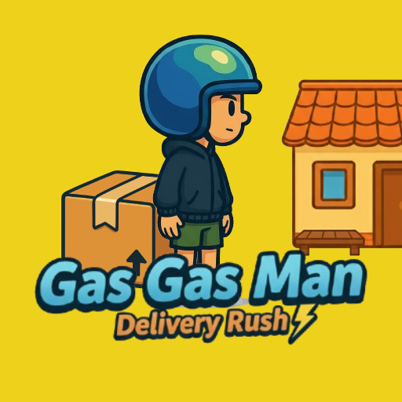

# Gas Gas Man



## Overview

**Gas Gas Man** is a small 2D delivery-themed throwing game built using **Godot Engine 4.5**.  
You play as a delivery rider whose goal is to throw packages accurately to customers’ houses while moving across the screen. Timing, aim, and momentum are key to achieving high scores.

This project was developed as part of a **storyboard and game development course project**, with a focus on simple mechanics, Indonesian-themed humor, and polished details.

---

## Features

- Infinite scrolling background environment
- Package-throwing system using 2D physics
- Target and timer system for gameplay objectives
- Result screen with confetti effects
- Simple mobile tap and keyboard controls
- Modular scene architecture for reusability

---

## Project Structure

```

gas-gas-man/
│
├── assets/
│   ├── sprites/        # Sprites and game logo
│   ├── fonts/          # Game fonts
│   └── sfx/            # Sound effects
│
├── scenes/             # Game scenes (Player, HUD, Environment)
├── scripts/            # Game logic and behaviors
└── README.md

```

---

## Getting Started

### 1. Requirements

- [Godot Engine 4.5+](https://godotengine.org/download)
- A modern operating system (Windows, macOS, or Linux)

### 2. Clone the Repository

```bash
git clone https://github.com/USERNAME/gas-gas-man.git
cd gas-gas-man
```

### 3. Open in Godot

1. Launch Godot Engine
2. Click **Import Project**
3. Select the project folder (`gas-gas-man/`)
4. Press **Run** (F5) to start the game

---

## Controls

| Action        | Input Method     |
| ------------- | ---------------- |
| Throw Package | Spacebar / Tap   |
| Move Player   | Auto-scrolling   |
| Pause / Menu  | Esc or UI Button |

---

## Gameplay Goal

Deliver as many packages as possible to reach your target score before the timer runs out.
Failed throws reduce your accuracy and total score.
When you meet your delivery quota, the game ends with a results screen showing your final stats.

---

## Development Notes

- Built in **Godot 4.5.0 stable**
- Designed for **2D side-scrolling gameplay**
- All assets are hand-crafted and optimized for mobile and desktop

---

## Credits

**Developed by:**
Aris Kurniawan and team (4 members collaboration project)

**Special thanks to:**
Universitas Budi Luhur – Faculty of Information Technology

---

## License

This project is available for **educational and non-commercial use**.
If you use any part of this game, please include proper attribution.

---

## Contact

For feedback or collaboration inquiries:
**Aris Kurniawan** – [GitHub](https://github.com/arisros)
